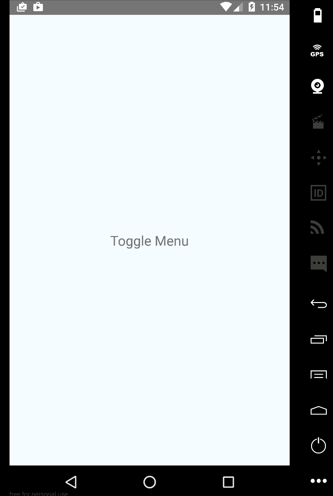

*** Props ***
- menu: The menu component
- onAnimationChange: callback with value from 0 to 1
- menuWidth: The width of the menu
- animatedValue: Optional ```Animated.Value(0)``` used to link animations inline with menu

*** Functions / util ***
- ref.close()
- ref.open()
- ref.state.isVisible

***Example***

```
import SideMenu = from 'react-native-simple-drawer';
```


```
    render() {
        const menu = (
            <View style={{padding:10}}>
                <Text>react-native-simple-drawer</Text>
            </View>
        )
        return (
            <SideMenu
                ref="menu"
                menu={menu}>
                <View>
                    <TouchableOpacity onPress={() => this.refs.menu.open()}>
                        <Text>Toggle Menu</Text>
                    </TouchableOpacity>
                </View>
            </SideMenu>
        );
    }
    };
```